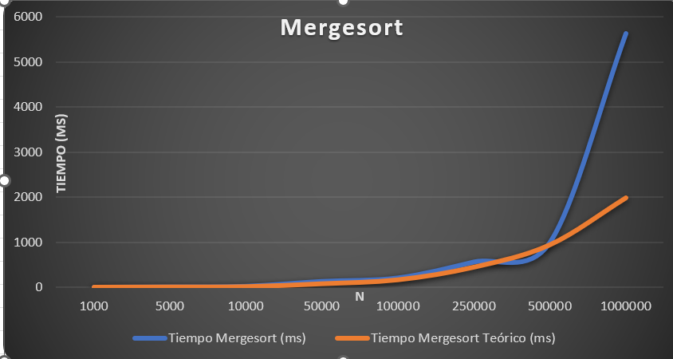
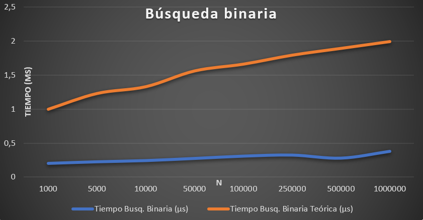

# Análisis de Algoritmos

## Mergesort — O(n log n)

Mergesort es un algoritmo de ordenamiento que divide el arreglo en partes más pequeñas y posteriormente las combina de forma ordenada. Su complejidad teórica es O(n log n).

### Gráfica de Mergesort

### Análisis

Los resultados muestran que el tiempo de ejecución aumenta conforme aumenta el tamaño del arreglo. La tendencia observada es compatible con el crecimiento esperado de O(n log n), aunque existen diferencias entre los valores experimentales y los teóricos.

## Búsqueda Binaria — O(log n)

La búsqueda binaria busca un elemento dividiendo el espacio de búsqueda aproximadamente a la mitad en cada paso. Su complejidad teórica es O(log n).

### Gráfica de Búsqueda Binaria

### Análisis

Los tiempos presentan un crecimiento pequeño conforme aumenta el tamaño del arreglo, lo cual es consistente con el comportamiento esperado de O(log n).

## Conclusión

Los resultados del benchmark muestran comportamientos compatibles con las complejidades teóricas de ambos algoritmos. Mergesort presenta un crecimiento aproximado de O(n log n), mientras que Búsqueda Binaria presenta un crecimiento mucho más lento, correspondiente a O(log n).
